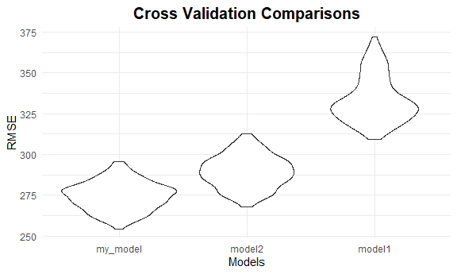

P8105 HW6
================
JingYao Geng
2020-11-25

## Problem 1

``` r
homicide_df = 
  read_csv("data-homicides-master/homicide-data.csv", na = c("", "NA", "Unknown")) %>% 
  mutate(
    city_state = str_c(city, state, sep = ", "),
    victim_age = as.numeric(victim_age),
    resolution = case_when(
      disposition == "Closed without arrest" ~ 0,
      disposition == "Open/No arrest"        ~ 0,
      disposition == "Closed by arrest"      ~ 1)
  ) %>% 
  filter(
    victim_race %in% c("White", "Black"),
    city_state != "Tulsa, AL") %>% 
  select(city_state, resolution, victim_age, victim_race, victim_sex)
```

Start with one city.

``` r
baltimore_df =
  homicide_df %>% 
  filter(city_state == "Baltimore, MD")
glm(resolution ~ victim_age + victim_race + victim_sex, 
    data = baltimore_df,
    family = binomial()) %>% 
  broom::tidy() %>% 
  mutate(
    OR = exp(estimate),
    CI_lower = exp(estimate - 1.96 * std.error),
    CI_upper = exp(estimate + 1.96 * std.error)
  ) %>% 
  select(term, OR, starts_with("CI")) %>% 
  knitr::kable(digits = 3)
```

| term              |    OR | CI\_lower | CI\_upper |
| :---------------- | ----: | --------: | --------: |
| (Intercept)       | 1.363 |     0.975 |     1.907 |
| victim\_age       | 0.993 |     0.987 |     1.000 |
| victim\_raceWhite | 2.320 |     1.648 |     3.268 |
| victim\_sexMale   | 0.426 |     0.325 |     0.558 |

Try this across cities.

``` r
models_results_df = 
  homicide_df %>% 
  nest(data = -city_state) %>% 
  mutate(
    models = 
      map(.x = data, ~glm(resolution ~ victim_age + victim_race + victim_sex, data = .x, family = binomial())),
    results = map(models, broom::tidy)
  ) %>% 
  select(city_state, results) %>% 
  unnest(results) %>% 
  mutate(
    OR = exp(estimate),
    CI_lower = exp(estimate - 1.96 * std.error),
    CI_upper = exp(estimate + 1.96 * std.error)
  ) %>% 
  select(city_state, term, OR, starts_with("CI")) 
```

``` r
models_results_df %>% 
  filter(term == "victim_sexMale") %>% 
  mutate(city_state = fct_reorder(city_state, OR)) %>% 
  ggplot(aes(x = city_state, y = OR)) + 
  geom_point() + 
  geom_errorbar(aes(ymin = CI_lower, ymax = CI_upper)) + 
  theme(axis.text.x = element_text(angle = 90, hjust = 1))
```


## Problem 2

**1. Data Import**

``` r
# Import
birthweight = read_csv("./data#2/birthweight.csv") %>%
  janitor::clean_names()

# str(birthweight)

# Tidy
birthweight = 
  birthweight %>%
  mutate(
    babysex = factor(babysex, levels = c(1,2), labels = c("male", "female")),
    frace = factor(frace, levels = c(1, 2, 3, 4, 8, 9), labels = c("white", "black", "asian"," puerto rican", "other", "unknown")),
    malform = factor(malform, labels = c("absent", "present")),
    mrace = factor(mrace,  c(1, 2, 3, 4, 8, 9), labels = c("white", "black", "asian"," puerto rican", "other", "unknown")),
    
    # pounds to grams
    delwt = delwt * 453.59237,
    ppwt = ppwt * 453.59237,
    wtgain = wtgain * 453.59237,
   
    mrace = fct_infreq(mrace),
    babysex = fct_infreq(babysex)
    )

# ways to check the existence of missing values:
#sum(is.na(birthweight))
#sum(!complete.cases(birthweight))
```

There are 4342 observations and 20variables in the `birthweight`
dataset. And there is 0 missing value in the dataset. In order to do the
following analyses, we convert the numeric variables `babysex`, `frace`,
`malform`, and `mrace` into factor variables, and also adjust the unit
from `pounds` to `grams` for variable `delwt`, `ppwt` and `wtgain`.

**Overview: regression model based on all available variables**

``` r
all = lm(bwt~.,data = birthweight)
summary(all)
## 
## Call:
## lm(formula = bwt ~ ., data = birthweight)
## 
## Residuals:
##      Min       1Q   Median       3Q      Max 
## -1097.68  -184.86    -3.33   173.09  2344.15 
## 
## Coefficients: (3 not defined because of singularities)
##                      Estimate Std. Error t value Pr(>|t|)    
## (Intercept)        -6.265e+03  6.604e+02  -9.487  < 2e-16 ***
## babysexfemale       2.871e+01  8.465e+00   3.391 0.000702 ***
## bhead               1.308e+02  3.452e+00  37.881  < 2e-16 ***
## blength             7.495e+01  2.022e+00  37.075  < 2e-16 ***
## delwt               9.041e-03  8.704e-04  10.386  < 2e-16 ***
## fincome             2.898e-01  1.795e-01   1.614 0.106551    
## fraceblack          1.433e+01  4.615e+01   0.311 0.756168    
## fraceasian          2.124e+01  6.930e+01   0.306 0.759273    
## frace puerto rican -4.700e+01  4.468e+01  -1.052 0.292912    
## fraceother          4.297e+00  7.407e+01   0.058 0.953745    
## gaweeks             1.155e+01  1.465e+00   7.882 4.06e-15 ***
## malformpresent      9.765e+00  7.063e+01   0.138 0.890039    
## menarche           -3.551e+00  2.895e+00  -1.226 0.220083    
## mheight             9.787e+00  1.031e+01   0.949 0.342588    
## momage              7.593e-01  1.222e+00   0.621 0.534418    
## mraceblack         -1.514e+02  4.605e+01  -3.289 0.001014 ** 
## mrace puerto rican -5.648e+01  4.514e+01  -1.251 0.210901    
## mraceasian         -9.139e+01  7.192e+01  -1.271 0.203908    
## parity              9.554e+01  4.048e+01   2.360 0.018307 *  
## pnumlbw                    NA         NA      NA       NA    
## pnumsga                    NA         NA      NA       NA    
## ppbmi               4.354e+00  1.489e+01   0.292 0.770017    
## ppwt               -7.653e-03  5.759e-03  -1.329 0.183913    
## smoken             -4.854e+00  5.871e-01  -8.269  < 2e-16 ***
## wtgain                     NA         NA      NA       NA    
## ---
## Signif. codes:  0 '***' 0.001 '**' 0.01 '*' 0.05 '.' 0.1 ' ' 1
## 
## Residual standard error: 272.5 on 4320 degrees of freedom
## Multiple R-squared:  0.7183, Adjusted R-squared:  0.717 
## F-statistic: 524.6 on 21 and 4320 DF,  p-value: < 2.2e-16
```

Based on the summary table of regression on all the variables, I decide
to select variables with a p value of coefficient that is smaller than 0
into my model.

**My model:**

  - Response: bwt: baby’s birth weight (grams)
  - Predictors:
      - babysex: baby’s sex
      - bhead: baby’s head circumference at birth (cm)
      - blength: baby’s length at birth (cm)
      - delwt: month’s weight at delivery (pounds)
          - need to convert to grams\!
      - gaweeks: gestational age in weeks
      - mrace: mother’s race
      - parity: number of live births prior to this pregnancy.
      - smoken: average number of cigarettes smoked per day during
        pregnancy

<!-- end list -->

``` r
my_model = lm(bwt ~ babysex + bhead + blength + delwt + smoken, data = birthweight) 
my_model %>% broom::tidy() %>% knitr::kable()
```

| term          |       estimate |  std.error |   statistic |   p.value |
| :------------ | -------------: | ---------: | ----------: | --------: |
| (Intercept)   | \-6150.0876831 | 96.9345132 | \-63.445799 | 0.0000000 |
| babysexfemale |     38.1913696 |  8.7813116 |    4.349165 | 0.0000140 |
| bhead         |    144.4899560 |  3.4835921 |   41.477289 | 0.0000000 |
| blength       |     82.0715503 |  2.0630356 |   39.781937 | 0.0000000 |
| delwt         |      0.0046642 |  0.0004438 |   10.508548 | 0.0000000 |
| smoken        |    \-1.7800922 |  0.5866197 |  \-3.034491 | 0.0024237 |

``` r
# summary(my_model)
```

**My\_model: A plot of model residuals against fitted values**

``` r
pred_vs_resid =  
    birthweight %>% 
    add_predictions(my_model) %>% 
    add_residuals(my_model) %>% 
    select(pred, resid) %>%
    ggplot(aes(x = pred, y = resid)) + 
    geom_point(alpha = 0.5, size = 0.8, color = "lightblue")  + 
    geom_smooth(method = "lm", color = "red", linetype = 2) + 
    #geom_line(aes(y = 0), linetype = "dashed", color = "red") +
    #geom_hline(yintercept = 0, color = "red", size = 1, linetype = 2) +
    labs(title = "Predicted vs Residuals", 
       x = "Predicted (grams)", 
       y = "Residuals (grams)")
```

**Compare my model to the following two models:**

``` r
# One using length at birth and gestational age as predictors (main effects only)
model1 = lm(bwt ~ blength + gaweeks, data = birthweight) %>%
  #broom::glance() %>% 
  broom::tidy() %>%
  knitr::kable()
#One using head circumference, length, sex, and all interactions (including the three-way interaction) between these
model2 = lm(bwt ~ bhead * blength * babysex, data = birthweight) %>%
  #broom::glance() %>%
  broom::tidy() %>%
  knitr::kable()

model1; model2
```

| term        |     estimate | std.error |  statistic | p.value |
| :---------- | -----------: | --------: | ---------: | ------: |
| (Intercept) | \-4347.66707 | 97.958360 | \-44.38281 |       0 |
| blength     |    128.55569 |  1.989891 |   64.60439 |       0 |
| gaweeks     |     27.04673 |  1.717930 |   15.74379 |       0 |

| term                        |       estimate |    std.error |   statistic |   p.value |
| :-------------------------- | -------------: | -----------: | ----------: | --------: |
| (Intercept)                 | \-7176.8170221 | 1264.8397394 | \-5.6740920 | 0.0000000 |
| bhead                       |    181.7956350 |   38.0542051 |   4.7772811 | 0.0000018 |
| blength                     |    102.1269235 |   26.2118095 |   3.8962180 | 0.0000992 |
| babysexfemale               |   6374.8683508 | 1677.7669213 |   3.7996150 | 0.0001469 |
| bhead:blength               |    \-0.5536096 |    0.7802092 | \-0.7095656 | 0.4780117 |
| bhead:babysexfemale         |  \-198.3931810 |   51.0916850 | \-3.8830816 | 0.0001047 |
| blength:babysexfemale       |  \-123.7728875 |   35.1185360 | \-3.5244319 | 0.0004288 |
| bhead:blength:babysexfemale |      3.8780531 |    1.0566296 |   3.6702106 | 0.0002453 |

**Cross validation comparisons:**

``` r
# test/train datasets
cv_bw = 
    crossv_mc(birthweight, 200) %>% 
    mutate(
        train = map(train, as.tibble),
        test = map(test,as.tibble)
    ) 
# rmse values for iterated linear models
cv_bw = cv_bw %>% 
    mutate(
        my_model = map(train,~lm(bwt ~ babysex + bhead + blength + delwt + mrace + gaweeks + smoken, data = .x)),
        model1 = map(train,~lm(bwt ~ blength + gaweeks, data = .x)),
        model2 = map(train,~lm(bwt ~ bhead * blength * babysex, data = .x))
    ) %>% 
    mutate(
        rmse_my_model = map2_dbl(my_model, test, ~rmse(model = .x,data = .y)),
        rmse_model1 = map2_dbl(model1, test, ~rmse(model = .x,data = .y)),
        rmse_model2 = map2_dbl(model2, test, ~rmse(model = .x,data = .y))
    )

# plot of comparisons
cv_bw %>% 
  select(starts_with("rmse")) %>% 
  pivot_longer(
    everything(),
    names_to = "models",
    values_to = "rmse",
    names_prefix = "rmse_"
  ) %>% 
  mutate(
    models = fct_reorder(models,rmse)) %>% 
  ggplot(aes(x = models, y = rmse)) +
  geom_violin() +
  labs(
        title = "Cross Validation Comparisons",
        x = "Model",
        y = "Root Mean Squared Error")
```



## Problem 3

**1. Data Import**

``` r
weather_df = 
  rnoaa::meteo_pull_monitors(
    c("USW00094728"),
    var = c("PRCP", "TMIN", "TMAX"), 
    date_min = "2017-01-01",
    date_max = "2017-12-31") %>%
  mutate(
    name = recode(id, USW00094728 = "CentralPark_NY"),
    tmin = tmin / 10,
    tmax = tmax / 10) %>%
  select(name, id, everything())
```
